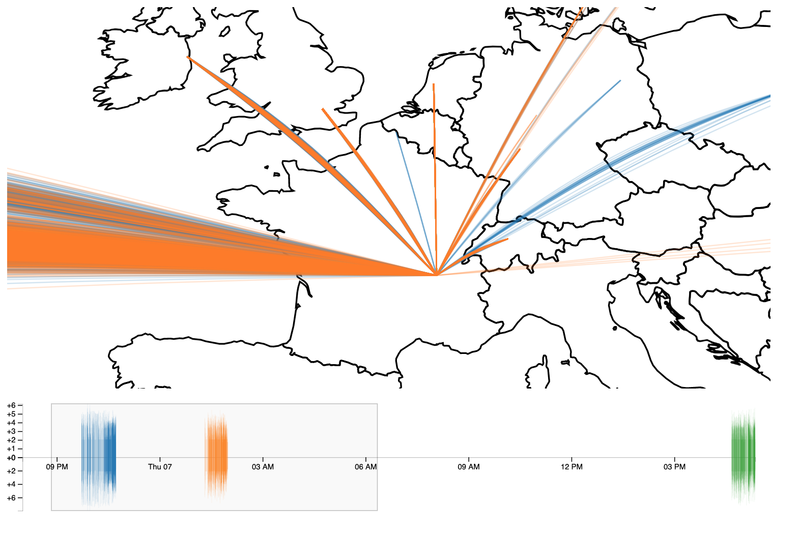

# Viz4Wisdom
Data Visualisation to grasp the where our data streams are channeled depending on the services we used.

# First exploratory analysis
You can find the data anlaysis conducted on the first data collected here :
https://docs.google.com/spreadsheets/d/1ZoKiVElGGo7zHfv38wp9YLzNDbKzfDpbsRqes_WraLI/edit?usp=sharing

The first data batch we achieved to collect is made of all the packets leaving and arriving on a single machine on a span of one day. As it represents an amount of 977 315 lines in a text file (one line a packet), for a file size 127 MB, we made the choice to only upload a mini sample of the raw data to help the user grasp the data structure. However, the user will find all the processed data in the google sheet given in the previous link.

The first data exploration allowed us to confirm the great disparity in the number of packets exchanged according to the IP Address, as we had imagined. However, all the exchanged are mainly concentrated on a few IP Addresses, which gives us hope of a clear data visualisations. Indeed, in our project, it will be better if we have only a dozen hub of connections in order to discriminate more efficiently various huge Internet content providers - such as Amazon, Youtube, Netflix, ...

The raw data used for the first analysis can be found in the `first_analysis` folder, under the name of `fa_packets_data_sample.txt`.

# Design sheets

The design sheets can be found at the root of the project under the name `Viz4Wisdom_DesignSheets.pdf`

# Final approach
In the end, we decided to devide or analysis in three sessions : work, leisure, administrative. During each of them, we browsed only on websites that are related to the session. For instance, during the leisure session, we used platforms such as Youtube, Netflix, Facebook, Twitter, Reddit... The administrative session was focused on French administrative platforms for ministries, healthcare, political parties, energy suppliers. The work session is based on a software engineering student activity whois working on a website project visiting websites such as stackoverflow, language documentations, cloud platforms or overleaf.

To reduce the amount of data displayed and improve the performance, we decided to aggregate the packets every 60 seconds.

# Snapshots

Global Map :

Focus on France :

